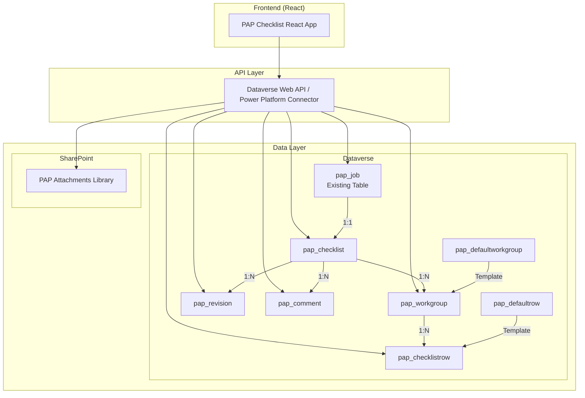

# PAP Checklist - Backend Implementation Plan

## Overview

This document outlines the backend architecture using **Microsoft Dataverse** for data storage and **SharePoint** for file/image attachments. The system integrates with an existing **Job** table in Dataverse.

---

## Architecture Diagram



---

## Dataverse Table Schema

### 1. `pap_job` (Existing Table)

> **Note:** This table already exists. The checklist will link to it via a lookup.

| Column | Type | Description |
|--------|------|-------------|
| `pap_jobid` | GUID (PK) | Primary key |
| `pap_jobreference` | String | e.g., "PRJ-2024-0142" |
| `pap_name` | String | Project title |
| `pap_client` | Lookup | Client contact |
| `pap_status` | Choice | Job status |
| ... | ... | Other existing fields |

---

### 2. `pap_checklist` (New Table)

| Column | Type | Required | Description |
|--------|------|----------|-------------|
| `pap_checklistid` | GUID (PK) | Yes | Primary key |
| `pap_name` | String (100) | Yes | Display name (auto-generated from job) |
| `pap_jobid` | Lookup → pap_job | Yes | Link to parent job (1:1) |
| `pap_currentrevisionnumber` | Whole Number | Yes | Current revision (default: 0) |
| `pap_status` | Choice | Yes | Draft \| In Review \| Final |
| `pap_clientcorrespondence` | Multiline Text | No | JSON array: `["Builder Copy", "Client Copy"]` |
| `pap_estimatetype` | Multiline Text | No | JSON array: `["FQE", "COM"]` |
| `pap_commonnotes` | Multiline Text | No | General notes |
| `pap_createdby` | Lookup → systemuser | Auto | Creator |
| `pap_createdon` | DateTime | Auto | Created timestamp |
| `pap_modifiedon` | DateTime | Auto | Last modified |

**Business Rules:**
- When a Job is created, auto-create a linked Checklist (via Power Automate flow)
- Populate default workgroups from `pap_defaultworkgroup` template

---

### 3. `pap_workgroup` (New Table)

| Column | Type | Required | Description |
|--------|------|----------|-------------|
| `pap_workgroupid` | GUID (PK) | Yes | Primary key |
| `pap_checklistid` | Lookup → pap_checklist | Yes | Parent checklist |
| `pap_number` | Whole Number | Yes | Workgroup number (20, 40, 180...) |
| `pap_name` | String (100) | Yes | e.g., "Preliminaries" |
| `pap_order` | Whole Number | Yes | Display order |
| `pap_summarynotes` | Multiline Text | No | Workgroup-level notes |
| `pap_isdefault` | Yes/No | Yes | From template (default: No) |
| `pap_iscustom` | Yes/No | Yes | User-added (default: No) |

---

### 4. `pap_checklistrow` (New Table)

| Column | Type | Required | Description |
|--------|------|----------|-------------|
| `pap_checklistrowid` | GUID (PK) | Yes | Primary key |
| `pap_workgroupid` | Lookup → pap_workgroup | Yes | Parent workgroup |
| `pap_description` | Multiline Text | No | Item description (rich text) |
| `pap_answer` | Choice | Yes | YES \| NO \| BLANK \| PS \| PC \| SUB \| OTS |
| `pap_notes` | Multiline Text | No | Detailed notes |
| `pap_markedforreview` | Yes/No | Yes | Review flag (default: No) |
| `pap_order` | Whole Number | Yes | Display order |
| `pap_isdefault` | Yes/No | Yes | From template |
| `pap_iscustom` | Yes/No | Yes | User-added |

---

### 5. `pap_revision` (New Table)

| Column | Type | Required | Description |
|--------|------|----------|-------------|
| `pap_revisionid` | GUID (PK) | Yes | Primary key |
| `pap_checklistid` | Lookup → pap_checklist | Yes | Parent checklist |
| `pap_number` | Whole Number | Yes | Revision number (1, 2, 3...) |
| `pap_summary` | Multiline Text | Yes | Change description |
| `pap_snapshotjson` | Multiline Text (Max) | Yes | JSON snapshot of checklist state |
| `pap_createdby` | Lookup → systemuser | Auto | Creator |
| `pap_createdon` | DateTime | Auto | Created timestamp |

---

### 6. `pap_comment` (New Table)

| Column | Type | Required | Description |
|--------|------|----------|-------------|
| `pap_commentid` | GUID (PK) | Yes | Primary key |
| `pap_checklistid` | Lookup → pap_checklist | Yes | Parent checklist |
| `pap_text` | Multiline Text | Yes | Comment content |
| `pap_author` | String (100) | Yes | Author name |
| `pap_createdon` | DateTime | Auto | Created timestamp |

---

### 7. `pap_defaultworkgroup` (Template Table)

| Column | Type | Required | Description |
|--------|------|----------|-------------|
| `pap_defaultworkgroupid` | GUID (PK) | Yes | Primary key |
| `pap_number` | Whole Number | Yes | Workgroup number |
| `pap_name` | String (100) | Yes | Workgroup name |
| `pap_order` | Whole Number | Yes | Default order |
| `pap_isactive` | Yes/No | Yes | Active for new checklists |

**Sample Data:**
| Number | Name | Order |
|--------|------|-------|
| 20 | Preliminaries | 0 |
| 40 | Demolition | 1 |
| 180 | Structural | 2 |
| 510 | Plumbing | 3 |
| 620 | Electrical | 4 |

---

### 8. `pap_defaultrow` (Template Table)

| Column | Type | Required | Description |
|--------|------|----------|-------------|
| `pap_defaultrowid` | GUID (PK) | Yes | Primary key |
| `pap_defaultworkgroupid` | Lookup → pap_defaultworkgroup | Yes | Parent template workgroup |
| `pap_description` | Multiline Text | Yes | Default item description |
| `pap_order` | Whole Number | Yes | Default order |
| `pap_isactive` | Yes/No | Yes | Active for new checklists |

---

## SharePoint Integration

### Document Library: `PAP Attachments`

**Location:** SharePoint site connected to the Power Platform environment

**Folder Structure:**
```
PAP Attachments/
├── {checklistId}/
│   ├── files/
│   │   ├── structural-drawings.pdf
│   │   └── site-plan.dwg
│   └── images/
│       ├── {rowId}/
│       │   ├── image-001.jpg
│       │   └── image-002.png
│       └── {rowId}/
│           └── photo.jpg
```

### Metadata Columns on Library

| Column | Type | Description |
|--------|------|-------------|
| `ChecklistId` | Single line text | Links to Dataverse checklist ID |
| `RowId` | Single line text | Links to specific row (for images) |
| `FileType` | Choice | Attachment \| Image |
| `Caption` | Single line text | Image caption |
| `Order` | Number | Display order for images |
| `UploadedBy` | Person | User who uploaded |

### API Integration

Use **Microsoft Graph API** or **SharePoint REST API** to:
1. Upload files to the correct folder
2. Set metadata on upload
3. Retrieve file URLs for display
4. Delete files when removed from UI

---

## Power Automate Flows

### Flow 1: Auto-Create Checklist on Job Creation

**Trigger:** When a row is added to `pap_job`

**Actions:**
1. Create new `pap_checklist` record linked to job
2. Query all active `pap_defaultworkgroup` records
3. For each default workgroup:
   - Create `pap_workgroup` with `pap_isdefault = true`
   - Query active `pap_defaultrow` for this workgroup
   - Create `pap_checklistrow` for each default row

### Flow 2: Create Revision Snapshot

**Trigger:** When "Create Revision" is called (via custom action or HTTP)

**Actions:**
1. Query all workgroups and rows for checklist
2. Build JSON snapshot
3. Create `pap_revision` record with snapshot
4. Increment `pap_currentrevisionnumber` on checklist

---

## API Service Layer

The React app will use the **Dataverse Web API** via:
- **MSAL.js** for authentication (Azure AD)
- **Fetch API** for HTTP requests

### Service Interfaces

```typescript
interface IDataverseChecklistService extends IChecklistService {
    // Inherits from existing interface
    getChecklistByJobId(jobId: string): Promise<Checklist>;
}

interface ISharePointFileService {
    uploadFile(checklistId: string, file: File): Promise<ChecklistFile>;
    uploadImage(checklistId: string, rowId: string, file: File, caption?: string): Promise<ChecklistImage>;
    deleteFile(fileUrl: string): Promise<void>;
    getFilesForChecklist(checklistId: string): Promise<ChecklistFile[]>;
    getImagesForRow(rowId: string): Promise<ChecklistImage[]>;
}
```

---

## Security Model

### Dataverse Security Roles

| Role | Checklist | Workgroup | Row | Revision | Comment |
|------|-----------|-----------|-----|----------|---------|
| **Estimator** | Read/Write (own) | Read/Write | Read/Write | Create | Read/Write |
| **Reviewer** | Read (all) | Read | Read | Read | Read/Write |
| **Admin** | Full | Full | Full | Full | Full |

### SharePoint Permissions

- Inherit from parent site permissions
- Restrict delete to Admins only (optional)

---

## Migration Considerations

1. **Existing Mock Data:** Can be migrated via Power Automate or a one-time script
2. **Default Templates:** Populate `pap_defaultworkgroup` and `pap_defaultrow` before go-live
3. **Testing:** Use a development Dataverse environment for integration testing

---

## Next Steps

1. [ ] Create Dataverse tables in development environment
2. [ ] Create SharePoint document library with metadata columns
3. [ ] Build Power Automate flows for auto-creation
4. [ ] Implement `DataverseChecklistService` in React app
5. [ ] Implement `SharePointFileService` for attachments
6. [ ] Configure authentication (MSAL.js / Azure AD)
7. [ ] End-to-end testing
8. [ ] User acceptance testing
